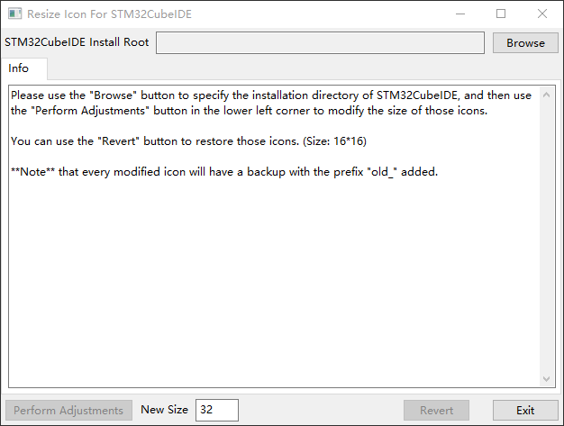

## Resize Icon For STM32CubeIDE

** Never used it under Linux !!! **

### Operating environment

- Python 3.8 +
  - pip3
  - wxPython
  - pillow 

### Description

Because the toolbar icons of STM32CubeIDE are too small, it is almost impossible to see what they are on a 4K monitor, so there is this tool to adjust their size.

Please use the **`Browse`** button to specify the installation directory of STM32CubeIDE, and then use the **`Perform Adjustments`** button in the lower left corner to modify the size of those icons.

You can use the **`Revert`** button to restore those icons. (Size: 16*16)

**Note** that every modified icon will have a backup with the prefix ***" old_ "*** added.

### Installation dependencies

```shell
pip3 install -U pillow
pip3 install -U wxPython
```

### Instructions

```shell
python BigIcon.py
```

So you only need to download **`BigIcon.py`**, unless you plan to beautify its UI, then other files are needed.




### 2021.9.22

**An unrecognized image appeared:**

PIL.UnidentifiedImageError: cannot identify image file 'D:\\Tools\\MCU\\ti\\ccs1040\\ccs\\eclipse\\plugins\\org.eclipse.platform_4.14.0.v20191210-0610\\eclipse_lg.png'

**Fix :** Use try...except !

